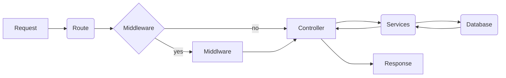

# :warning: These are not updated

# My CCET

<!-- START doctoc generated TOC please keep comment here to allow auto update -->
<!-- DON'T EDIT THIS SECTION, INSTEAD RE-RUN doctoc TO UPDATE -->

**Table of Contents**

- [How to setup the project](#how-to-setup-the-project)
  - [Pre-requisites](#pre-requisites)
  - [Steps](#steps)
- [Docs](#docs)
  - [API Endpoints](#api-endpoints)
  - [Create super admin](#create-super-admin)
- [Request Response cycle](#request-response-cycle)
  - [Folder Structure](#folder-structure)
  - [Adding a new functionality](#adding-a-new-functionality)
  - [Response Format](#response-format)
    - [Success](#success)
    - [Error](#error)

<!-- END doctoc generated TOC please keep comment here to allow auto update -->

## How to setup the project

### Pre-requisites

1. [Node.js](https://nodejs.org/en)
2. [Yarn](https://classic.yarnpkg.com/lang/en/docs/install/#mac-stable)
3. [MongoDB](https://www.mongodb.com/try/download/community)

### Steps

1. Clone the repository by running the following command in your terminal:

```bash
git clone git@github.com:aayushchugh/myccet-server.git
```

2. Install the dependencies by running the following command in your terminal:

```bash
yarn install
```

3. Create a `.env` file in the root directory of the project and add the following environment variables:

```bash
PORT=<your-port>
DB_URI=<your-mongo-uri>
NODE_ENV="development"
ACCESS_TOKEN_PRIVATE_KEY=<your-access-token-private-key>
ACCESS_TOKEN_PUBLIC_KEY=<your-access-token-public-key>
REFRESH_TOKEN_PRIVATE_KEY=<your-refresh-token-private-key>
REFRESH_TOKEN_PUBLIC_KEY=<your-refresh-token-public-key>
```

4. Run the project by running the following command in your terminal:

```bash
yarn start
```

The server will start running on the port you specified in the `.env` file.

## Docs

### API Endpoints

All the API endpoints are documented using [postman](https://swagger.io/).

### Create super admin

To create super admin run the following command in your terminal:

```bash
yarn build

node build/bin/index.js create-admin -f <first-name> -e <email> -p <phone number> -s <password>
```

> :warning: make sure to run the command in the root directory of the project and replace the values in <> with the actual values.

## Request Response cycle



### Folder Structure

```
├── src
│   ├── app.ts
│   ├── controllers -> contains all the controllers
│   │   └── auth.controller.ts
│   ├── middlewares -> contains all the middlewares
│   │   └── deserializeUser.middleware.ts
│   ├── routes -> contains all the routes
│   │   └── auth.routes.ts
│   ├── schemas -> contains all the schemas, schemas are created using zod, schemas are used to validate the request body
│   │   └── auth.schema.ts
│   ├── models -> contains database schemas
│   │   └── user.model.ts
│   ├── services -> contains all queries related to database
│   │   └── user.service.ts
│   └── utils -> contains all the utility functions
│       └── logger.util.ts
```

### Adding a new functionality

1. Ensure that you have the latest version of the `main` branch by running the following command in your terminal:

```bash
git pull origin main
```

2. Create a new branch by running the following command in your terminal:

```bash
git checkout -b <branch-name>
```

3. Make sure that model is created for the new functionality in the `models` folder.

   > Eg: If you are creating a route to register a user, then make sure that the `user.model.ts` file is created in the `models` folder.
   > and all the required fields are added to the model.

4. Create a new schema for the new functionality in the `schemas` folder.

   > Eg: If you are creating a route to register a user, then make sure that the `user.schema.ts` file is created in the `schemas` folder.
   > and all the required fields are added to the schema.

5. Create a new controller for the new functionality in the `controllers` folder.

   > Eg: If you are creating a route to register a user, then make sure that the `auth.controller.ts` file is created in the `controllers` folder.
   > and all the required functions are added to the controller.

6. Create a new route for the new functionality in the `routes` folder.

   > Eg: If you are creating a route to register a user, then make sure that the `auth.routes.ts` file is created in the `routes` folder.
   > and all the required routes are added to the routes file.

7. Register the new routes in the `app.ts` file.

8. Write documentation for the new routes in the `swagger.json` file.
9. Commit your changes by running the following command in your terminal:

```bash
git add .
git commit -m "<commit-message>"
```

10. Push your changes by running the following command in your terminal:

```bash
git push origin <branch-name>
```

11. Create a pull request to merge your changes to the `main` branch.
12. Wait for the pull request to be reviewed and merged.

### Response Format

All the API endpoints return the response in the following format:

#### Success

1. Successful Response

```json
{
	"success": true,
	"statusCode": 201,
	"data": {
		"message": "UserModel registered successfully"
	}
}
```

2. Successful Response with multiple records

```json
{
	"success": true,
	"statusCode": 200,
	"data": {
		"message": "Users fetched successfully",
		"records": [
			{
				"name": "John Doe",
				"email": "john@gmail.com"
			},
			{
				"name": "Harry Potter",
				"email": "harry@gmail.com"
			}
		],
		"count": 2,
		"limit": 10,
		"page": 1
	}
}
```

3. Successful Response with single record

```json
{
	"success": true,
	"statusCode": 200,
	"data": {
		"message": "UserModel fetched successfully",
		"record": {
			"name": "John Doe",
			"email": "john@gmail.com"
		}
	}
}
```

#### Error

1. Error Response

```json
{
	"success": false,
	"statusCode": 409,
	"error": {
		"detail": "User already exists",
		"code": "USER_ALREADY_EXISTS"
	}
}
```

> :warning: Make sure that the response is returned in the above format only and contains proper status codes.
